# Puhkuste halduse juhend

## Sissejuhatus

Käesolev juhend on loodud eesmärgiga selgitada ja juhendada puhkuste halduse kasutajale lahenduse kasutamist. Juhendis toodud ekraanipildid on illustratiivsed ning võivad kohati erineda teie lahendusest.

Kõik juhendis kuvatud või kirjeldatud funktsionaalsus ei pruugi olemas olla teie süsteemis – see sõltub lahenduse versioonist ning seadistustest.

## Puhkuste lisamine

### Vormi täitmine

1. Puhkuste lisamiseks navigeeri puhkusavalduse vormile:

    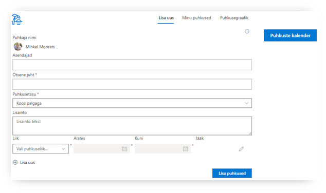

    Süsteem tuvastab sisse-logitud kasutaja ning otsese juhi (kui see on määratud).

2. Täida vajalikud väljad:

    1. **Asendaja** – saab määrata mitu isikut
    2. **Otsene juht** – süsteem tuvastab vaikimisi otsese juhi, kui see on määratud. Vajadusel saad muuta.
    3. **Puhkusetasu** – valikud: &#39;Koos palgaga&#39;, &#39;Enne puhkust&#39;
    4. **Lisainfo** – võimalus vajadusel edastada kinnitajale ja raamatupidajale täiendavat infot antud puhkuseavalduse kohta
    5. **Liik** – võimaldab valida puhkuseliigi. _Vaata lisaks: 2.2 Lapsega seotud puhkuste sisestamine_
    6. **Alates** – puhkuse alguse kuupäev
    7. **Kuni** – Puhkuse viimane päev

3. Süsteem arvutab automaatselt puhkusejäägi kuvades välja:

    1. Käesoleva puhkuse kestvuse
    2. Algse puhkusejäägi
    3. Puhkusejäägi peale antud avalduse jõustumist

    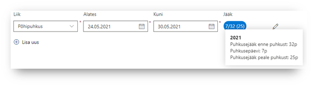

    Liikudes hiirega jäägi numbreid näitava ovaalikese peale, kuvatakse selgitav dialoogiaken.

4. Puhkuse sisestamise vormil saab korraga lisada mitme perioodi eest puhkused. Selleks klõpsa nuppu &#39;Lisa uus&#39;:

    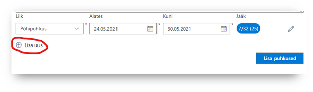

    Selliselt saab lisada mitu erinevat liiki puhkust korraga. Näiteks:

    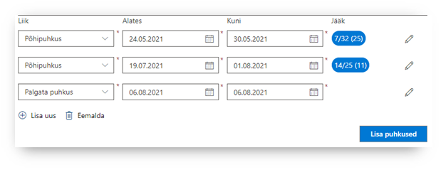

    Puhkuse perioodi eemaldamiseks klõpsa nupul &#39;Eemalda&#39;, see eemaldab viimati lisatud perioodi:

    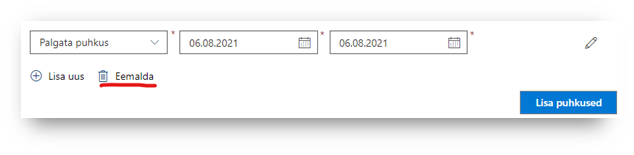

5. Puhkuseavaldusele manuse lisamiseks klõpsa puhkuse perioodi lõpus olevale pliiatsi ikoonile:

    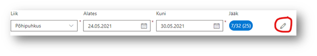

    Avaneb parem-paneel, kus saab lisada faili. Faili lisamise lohista fail punktiirjoonega kastikesse või klõpsa kastis sees ning vali arvutist fail:

    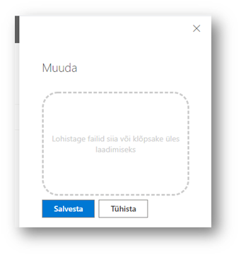

6. Klõpsa &#39;Lisa puhkused&#39; – süsteem salvestab sisestatud puhkuste info ning suunab &#39;Minu puhkused&#39; vaatesse. (vaata lähemal: Minu puhkused)

### Lapsega seotud puhkuste sisestamine

Lapsega seotud puhkuse sisestamisel süsteem avab paremas servas paneeli, kus saab valida lapse, kellega antud puhkus on seotud:

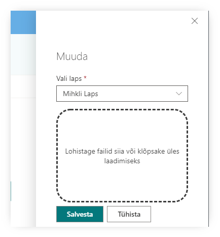

### Kattuvad puhkused

Süsteem kuvab hoiatuse, kui hakkad sisestama puhkust, mis:

1. kattub mõne sinu varem sisestatud puhkusega
2. kattub mõne sinu asendaja puhkusega

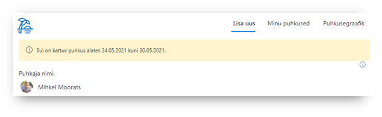

## Minu puhkused

### Eelolevad puhkused

&#39;Minu puhkused&#39; vaates kuvatakse välja kõiki:

1. sinu eelolevaid puhkuseid
2. puhkuseid, kus sa oled määratud asendajaks

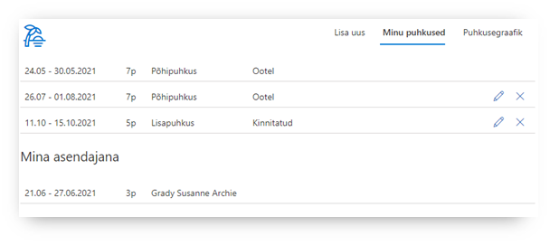

### Puhkuste muutmine

1. &#39;Minu puhkused&#39; vaates saab ise muuta oma esitatud puhkuseavaldusi, klikates pliiatsi ikoonile (Muuda).
2. Avaneb parem-paneelis puhkuseavalduse muutmise vorm
3. Vormil on võimalik lisada juurde ka &#39;Muutmise põhjendus&#39; – see teade on mõeldud kinnitajale selgituseks

    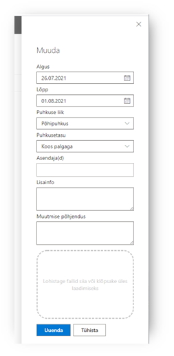

4. Muudatuste salvestamiseks Klõpsa &#39;Uuenda&#39; nupul

Sõltuvalt puhkuseavalduse staatusest teeb süsteem järgmist:

- Ootel – muudatused salvestatakse ning juht näeb kinnitamise vaates uuendatud infoga avaldust
- Kinnitatud/Reaalne puhkus – – muudatused salvestatakse ning puhkuseavaldus edastatakse juhile uuesti kinnitamiseks

Muuta saab vaid puhkuseid, mille algus ei ole lähemal kui 14 päeva (muudetav suurus, sõltub süsteemi seadistusest).

### Puhkuste tühistamine

1. &#39;Minu puhkused&#39; vaates saab ise tühistada oma esitatud puhkuseavaldusi, klikates ristiga ikoonile (Tühista).
2. Avaneb parem-paneel, kus saab sisestada tühistamise põhjenduse

    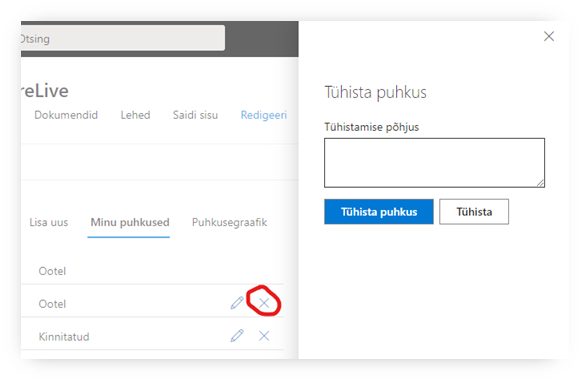

    Sõltuvalt puhkuseavalduse staatusest teeb süsteem järgmist:

    - Ootel – puhkusevaaldus määratakse tühistatuks
    - Kinnitatud/Reaalne puhkus – puhkusevaaldus määratakse &#39;Tühistamise ootel&#39;, kinnitaja saab meiliteavituse ning peab tühistamise ära kinnitama

    Tühistada saab vaid puhkuseid, mille algus ei ole lähemal kui 14 päeva (muudetav suurus, sõltub süsteemi seadistusest).

## Puhkuste kinnitamine

&#39;Kinnitamine&#39; vaate on nähtaval vaid juhtidele, kel on puhkuste kinnitamise õigus. Teised seda vaadet ei näe.

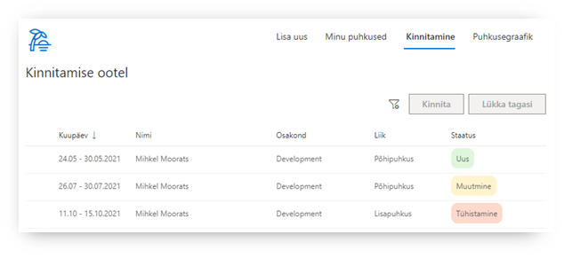

Enne kinnitamist on võimalik tutvuda ootel puhkustega, hiirega liikudes üle puhkuse perioodi, kuvatakse dialoogiaknas täpsem puhkuse info:

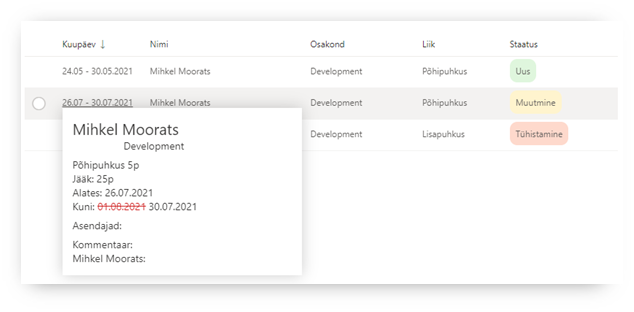

Täpsema info all on kuvatud muuhulgas:

- Muudatused puhkuse andmetes (varasem väärtus on punasega maha kriipsutatud)
- Lisainfo, kui see on puhkuse sisestamisel kirjutatud
- Kommentaar – kui puhkus on muudetud või tühistatud

&#39;Kinnitamine&#39; vaates kuvatakse 3 staatusega puhkuseid:

- Uus – tegemist uue puhkuse avaldusega (roheline)
- Muutmine – algset puhkuseavaldust on muudetud ning puhkus ootab uuesti juhi kinnitamist
- Tühistamine – töötaja on soovinud oma puhkuse tühistada

### Kinnitamine

1. Vali üks või mitu puhkuseavaldust klikates avalduse ees ringikese aktiivseks

    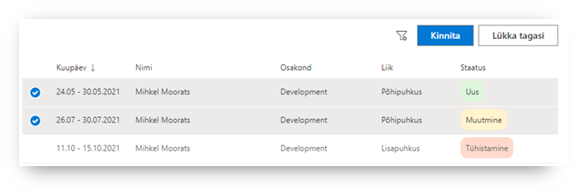

2. Klikka nupule &#39;Kinnita&#39;
3. Süsteem küsib üle, kas oled kindel (kuvatakse dialoogiaknas kinnituse küsimus)

    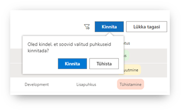

4. Klikka dialoogiaknas &#39;Kinnita&#39;
5. Valitud puhkused kinnitatakse ning need kaovad &#39;Kinnita&#39; vaatest ära
6. Töötajale saadetakse emaili teavitus, et tema puhkus on kinnitatud

### Filtreerimine

&#39;Kinnita&#39; vaates saab kasutada täiendavaid filteerimisi, klõpsates filtri ikoonil:

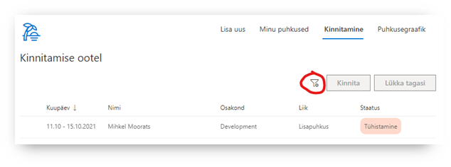

Avaneb filtrite paneel, kus saab kinnitamise ootel puhkuseid filtreerida järgmiste muutujate alusel:

- Isiku nimi
- Osakond
- Puhkuseliik
- Staatus

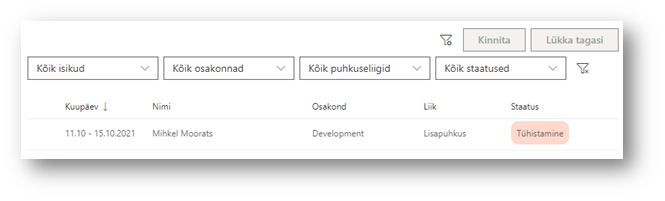
