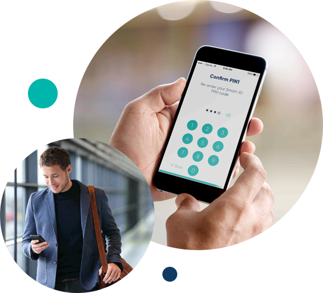
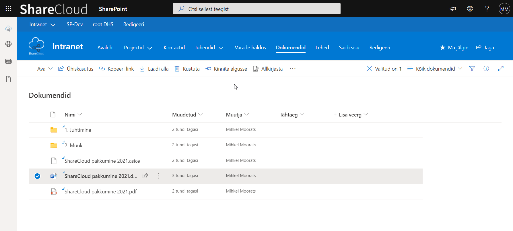
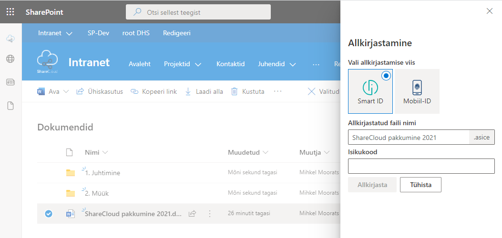
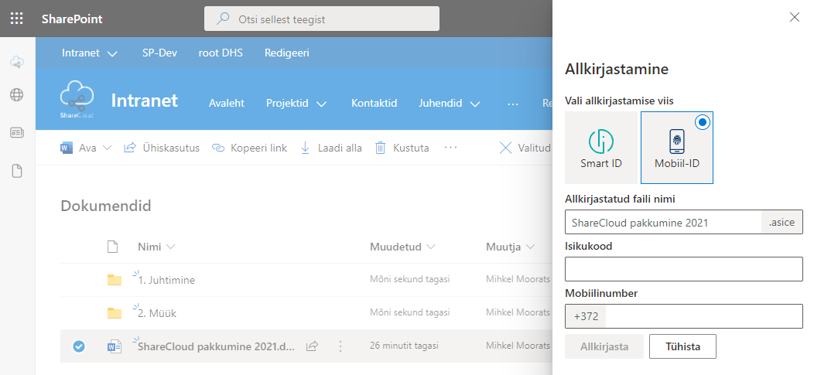
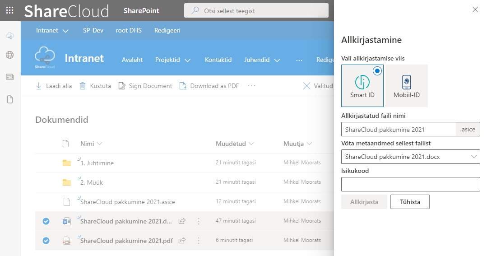

**Digiallkirjastamine otse Sharepointis**

Enam ei pea Sharepointis olevate dokumentide allkirjastamiseks faile alla laadima oma arvutisse. Seda saab teha otse Sharepointi keskkonnas paari hiireklõpsuga.

**Lahenduse eelised:**

* Smart-ID allkirjastamine
* Mobiil-ID allkirjastamine
* allkirjasta mitu dokumenti korraga
* dokumendi andmed kantakse üle allkirjastatud failile
* toimib ka mobiiltelefonis Sharepointi rakenduses

**Kuidas kasutada?**

Allkirjastamiseks vali dokument või dokumendid, mida soovid allkirjastada ning klõpsa nupul 'Allkirjasta':

Avanevas paneelis saab valida Smart-ID või Mobiil-ID allkirjastamise võimaluste vahel. Lisaks saad määrata ka loodava allkirjastatud faili nime. Vaikimisi määrab süsteem sama failinime, mis valitud dokumendil.

**Smart-ID allkirjastamine**

Sisesta isikukood ja peagi saad telefoni allkirjastamise kinnitamiseks teavituse:

**Mobiil-ID allkirjastamine**

Sisesta isikukood ja mobiilinumber ja peagi saad telefoni allkirjastamise kinnitamiseks teavituse:

**Andmed kanduvad allkirjastatud failile üle**

Sageli kasutatakse dokumentide paremaks leidmiseks täiendavaid andmeveerge, mis dokumenti kirjeldavad (tähtaeg, lepingu number, vastutaja, jne).
Allkirjastamise käigus kantakse kõik valitud dokumendi andmed üle ka allkirjastatud failile.
Mitme dokumendi korraga allkirjastamisel saab valida millise dokumendi andmed loodavale allkirjastatud failile üle kantakse.

