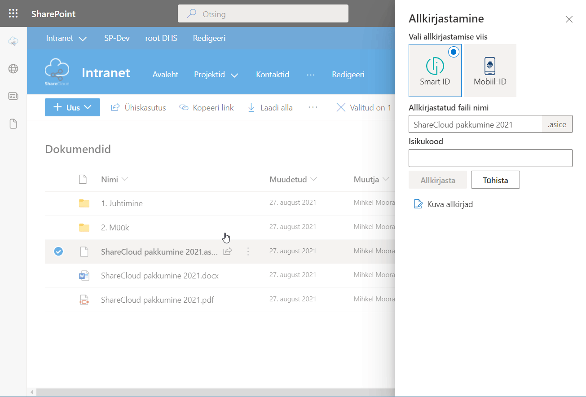
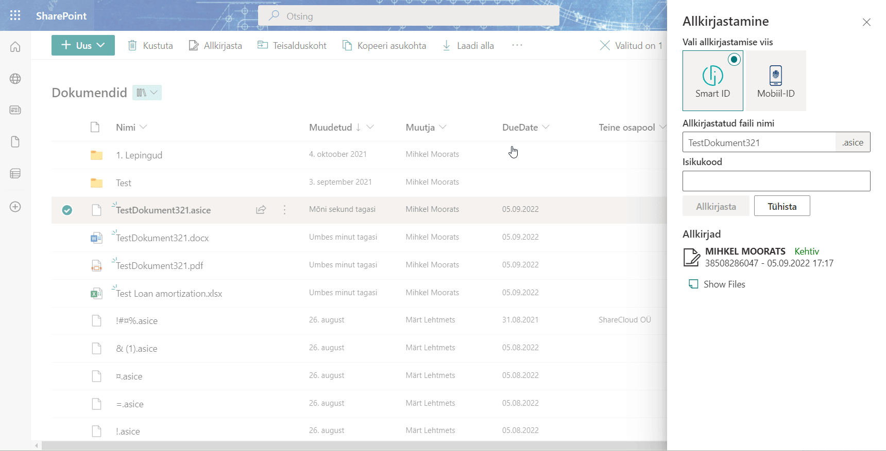

**Digiallkirjastamine otse Sharepointis**

Enam ei pea Sharepointis olevate dokumentide allkirjastamiseks faile alla laadima oma arvutisse. Seda saab teha otse Sharepointi keskkonnas paari hiireklõpsuga.

**Lahenduse eelised:**

* **UUS!** failide vaatamine digikonteineri seest otse browseris
* Smart-ID allkirjastamine
* Mobiil-ID allkirjastamine
* allkirjasta mitu dokumenti korraga
* dokumendi andmed kantakse üle allkirjastatud failile
* toimib ka mobiiltelefonis Sharepointi rakenduses

**Kuidas kasutada?**

Allkirjastamiseks vali dokument või dokumendid, mida soovid allkirjastada ning klõpsa nupul 'Allkirjasta':

Avanevas paneelis saab valida Smart-ID või Mobiil-ID allkirjastamise võimaluste vahel. Lisaks saad määrata ka loodava allkirjastatud faili nime. Vaikimisi määrab süsteem sama failinime, mis valitud dokumendil.

**Smart-ID allkirjastamine**

Sisesta isikukood ja peagi saad telefoni allkirjastamise kinnitamiseks teavituse:

**Mobiil-ID allkirjastamine**

Sisesta isikukood ja mobiilinumber ja peagi saad telefoni allkirjastamise kinnitamiseks teavituse:

**Andmed kanduvad allkirjastatud failile üle**

Sageli kasutatakse dokumentide paremaks leidmiseks täiendavaid andmeveerge, mis dokumenti kirjeldavad (tähtaeg, lepingu number, vastutaja, jne).
Allkirjastamise käigus kantakse kõik valitud dokumendi andmed üle ka allkirjastatud failile.
Mitme dokumendi korraga allkirjastamisel saab valida millise dokumendi andmed loodavale allkirjastatud failile üle kantakse.

**Kontrolli allkirju**

Juba allkirjastatud digikontreineri sisse on veidi keeruline vaadata. Selleks, et aru saada, kes on juba allkirjastanud võimaldab lahendus kontrollide allkirjade staatust ja kehtivust

**Vaata konteineris olevaid faile**

Digiallkirjastatud failide hoidmisel Sharepointis on pikka aega olnud üks mure - konteiner-faili sisse nägemiseks pidi selle alla laadima. Oleme täiendanud digiallkirjastamise lahendust selliselt, et see võimaldab kasutajale kuvada ka konteineris olevaid faile. Tegime selle nii lihtsaks, et näed koguni faili sisu otse browserist.

**Ülevaade allkirjastamise aktiivsusest**

Et aru saada, kui aktiivselt digiallkirjastamise lahendust kasutatakse kogub süsteem anonüümset infot allkirjastamiste kohta ning talletab iga kuu kohta info mitu allkirjastamist ning allkirja valideerimist on mingis SP saidis tehtud.

***
Uuendame ja arendame digiallkirjastamise lahendust pidevalt edasi ning kõiki lahenduses olemasolevaid võimalusi ei pruugi siin kirjelduses veel üleval olla.
Kui Sul on mõte või idee, mis peaks kindlasti veel ühes head digiallkirjastamise lahenduses olema - anna meile julgelt märku: <mihkel@sharecloud.ee>

*Versioon: 1.1.10.112*