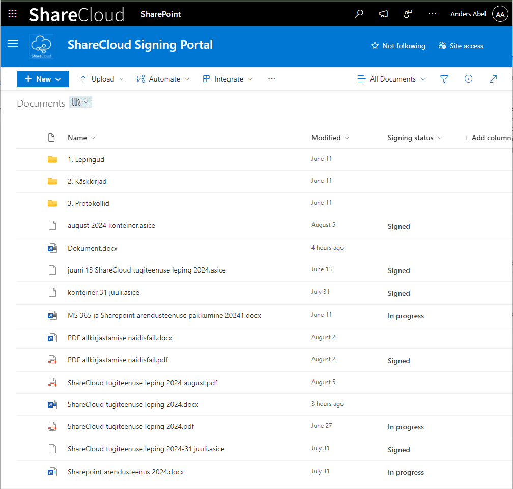
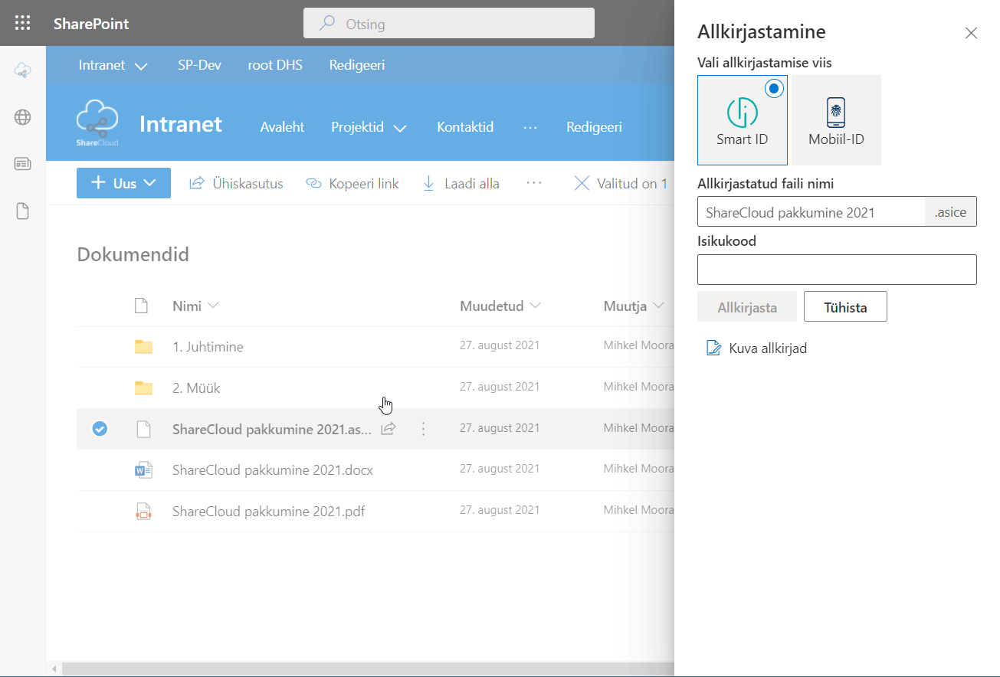
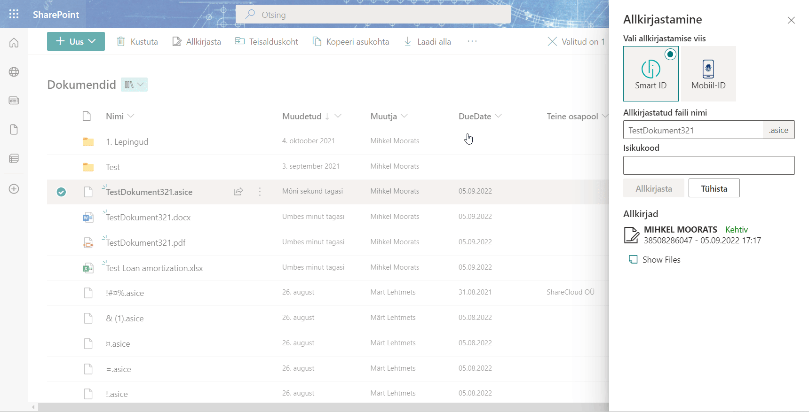

**Digiallkirjastamine otse Sharepointis**

Enam ei pea Sharepointis olevate dokumentide allkirjastamiseks faile alla laadima oma arvutisse. Seda saab teha otse Sharepointi keskkonnas paari hiireklõpsuga. Nüüd saab allkirjastamiseks saata dokumente ka välistele osapooltele - partneritele, alltöövõtjatele, klientidele, jne.

**Lahenduse eelised:**

- allkirjasta dokumente otse Sharepointis
- saada allkirjastaiseks dokumente ka **välistele osapooltele**
- saab määrata allkirjastajate järjekorra
- **failide kuvamine digikonteineri seest** otse browseris
- kontrolli allkirjade staatust ja kehtivust
- allkirjasta mitu dokumenti korraga
- toetatud asice ja PDF tüüpi allkirjastamine
- 

**Kuidas kasutada?**

1. Allkirjastamiseks vali dokument või dokumendid, mida soovid allkirjastada ning klõpsa nupul 'Sign':

2. Avanevas paneelis saab valida Asice või PDF tüüpi allkirjastamise vahel. Sulle kuvatakse valitud dokumendid, mida allkirjastamisele saadetakse. 

    Allkirjastajate plokis saad määrata, kas allkirjastajate järjekord on oluline või mitte. Ning seejärel lisada allkirjastajad. Allkirjastajateks saab valida isikuid nii enda ettevõttest kui ka väliseid osapooli. Väliste osapoolte lisamiseks tuleb sisestada nende nimi ja emaili aadress. 

    Iga allkirjastamise protsessis osaleja puhul saab määrata, kas ta on allkirjastaja või vaatleja antud protsessis.

3. Iga allkirjastaja saab emaili teavituse, et talle on edastatud failid allkirjastamiseks

4. Lingil või nupul klõpsates avaneb veebibrowseris allkirjastamise leht, kus saab tutvuda allkirjastatavate dokumentidega ning allkirjastada neid. Allkirjastamiseks saab kasutada ID-kaarti, Smart-ID või Mobiil-ID lahendust. Toetatud on erinevad keeled ja erinevate riikide allkirjastamise meetodid. Täpsemalt infot selle kohta: 

5. Peale edukat allkirjastamist kõigi osapoolte poolt saadab süsteem kõigile osapooltele emaili, et allkirjastamine on lõpetatud. 

6. Allkirjastatud failid salvestatakse otse Sharepointis ning nende sisuga saab tutvuda otse browseris

<!-- **PDF tüüpi allkirjastamine** -->

<!-- **Andmed kanduvad allkirjastatud failile üle**

Sageli kasutatakse dokumentide paremaks leidmiseks täiendavaid andmeveerge, mis dokumenti kirjeldavad (tähtaeg, lepingu number, vastutaja, jne).
Allkirjastamise käigus kantakse kõik valitud dokumendi andmed üle ka allkirjastatud failile.
Mitme dokumendi korraga allkirjastamisel saab valida millise dokumendi andmed loodavale allkirjastatud failile üle kantakse.

**Kontrolli allkirju**

Juba allkirjastatud digikontreineri sisse on veidi keeruline vaadata. Selleks, et aru saada, kes on juba allkirjastanud võimaldab lahendus kontrollide allkirjade staatust ja kehtivust

**Vaata konteineris olevaid faile**

Digiallkirjastatud failide hoidmisel Sharepointis on pikka aega olnud üks mure - konteiner-faili sisse nägemiseks pidi selle alla laadima. Oleme täiendanud digiallkirjastamise lahendust selliselt, et see võimaldab kasutajale kuvada ka konteineris olevaid faile. Tegime selle nii lihtsaks, et näed koguni faili sisu otse browserist.

**Ülevaade allkirjastamise aktiivsusest**

Et aru saada, kui aktiivselt digiallkirjastamise lahendust kasutatakse kogub süsteem anonüümset infot allkirjastamiste kohta ning talletab iga kuu kohta info mitu allkirjastamist ning allkirja valideerimist on mingis SP saidis tehtud.

---

Uuendame ja arendame digiallkirjastamise lahendust pidevalt edasi ning kõiki lahenduses olemasolevaid võimalusi ei pruugi siin kirjelduses veel üleval olla.
Kui Sul on mõte või idee, mis peaks kindlasti veel ühes head digiallkirjastamise lahenduses olema - anna meile julgelt märku: <mihkel@sharecloud.ee> -->

_Versioon: 1.3.1.181_
