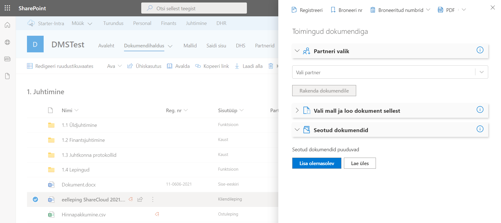
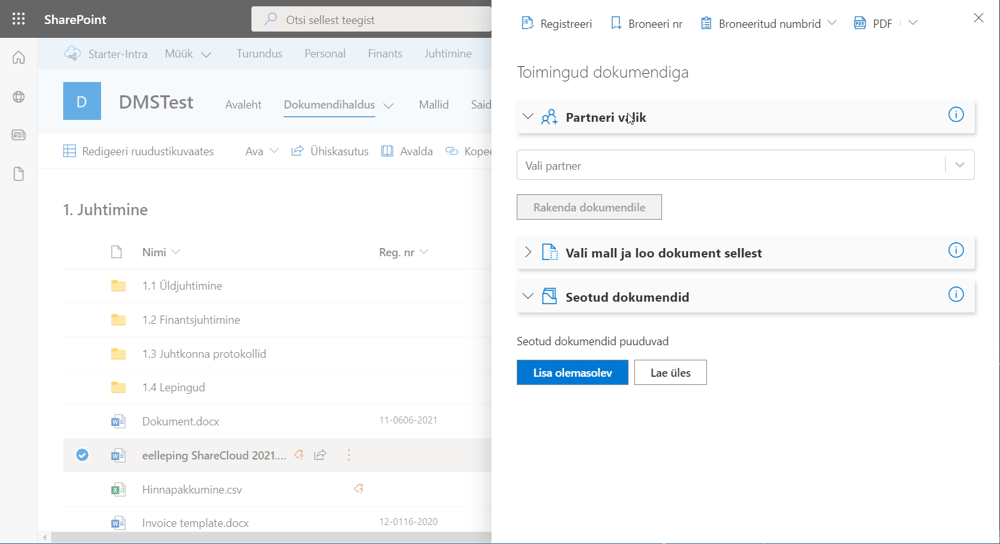
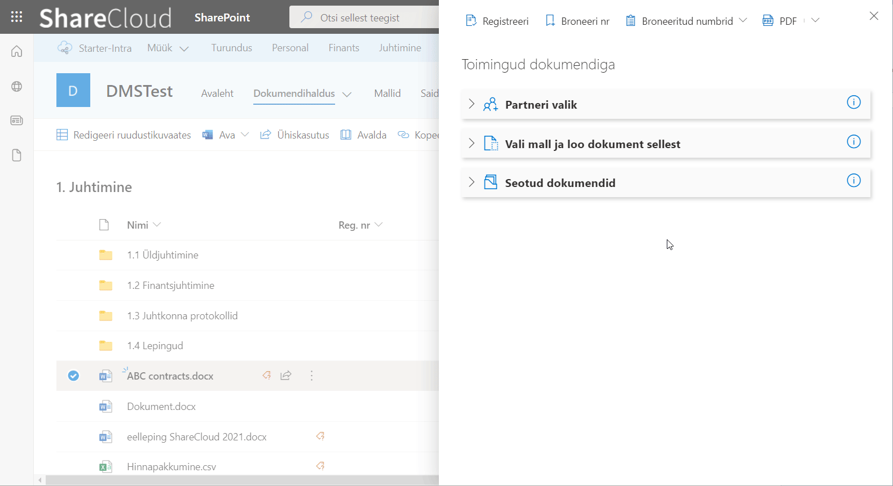
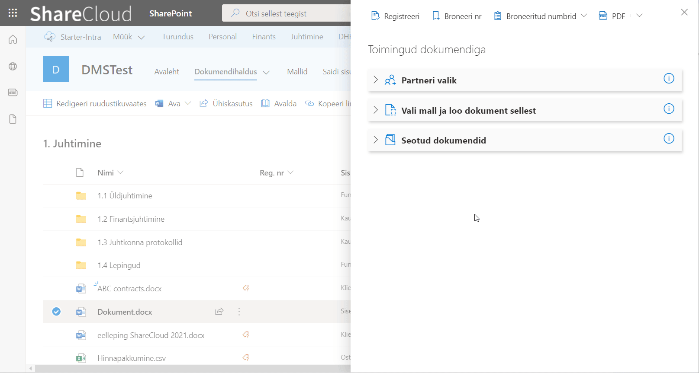
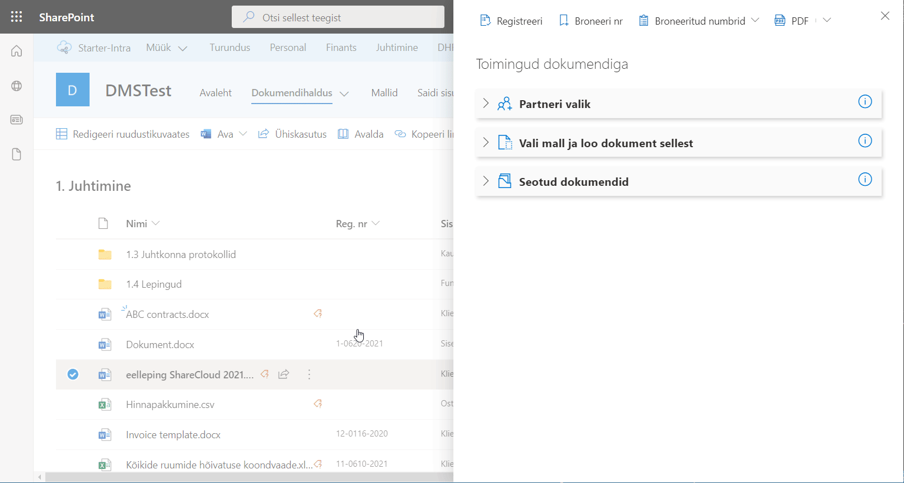

# Dokumendihaldus Sharepointis

Sharepoint on suurepärane platvorm tööks dokumentidega ja nende haldamiseks.
Vaikimisi on toetatud sellised olulised funktsionaalsused nagu:

* **versiooniajalugu** - iga muudatus dokumendiga talletub versiooniajalukku ning saab hilje kontrollida ning vajadusel taastada varasemat versiooni
* **sorteerimine ja filtreermine** - mistahes dokumendi andmeväljade järgi sorteerimise ja filtreerimise võimalus
* **otsing** - Sharepointi võimekas otsing leiab märksõnad ka levinud dokumentide sisust (Office dokumendid, PDF, jms)

Oleme omalt poolt lisanud dokumentidega töö lihtsustamiseks eraldi toimingute paneeli, mis muudab dokumentide haldamise veelgi lihtsamaks.

## Registreerimine
Registreerimine annab dokumendila unikaalse numbrikombinatsiooni, mille järgi on sedahiljem lihtsam leida ja identifitseerida.
Dokumendi numbris saab kajastada:

* käesolevat aastat
* viidet kaustale kus dokument asub
* viidet dokumendiliigile
* unikaalset numbriosa, mis iga registreerimisega suureneb

## Dokumendi numbri broneerimine
Broneerimine võimaldab küsida süsteemilt uue registreerimisnumbri ilma, et seda dokumendile veel rakendatakse. Sageli kasutatakse seda võimalust kui dokumenti pole veel süsteemi üles laetud, kui dokumendi sisusse on vaja number määrata.
Broneeritud numbri saab lihtsasti kopeerida ning kleepida dokumendile:

Juba broneeritud numbreid kuvatakse rippmenüüs, kust saab kohe numbri rakendada dokumendile:

## Salvesta dokument PDF-iks
PDF on laialt levinud ja kasutatud dokumendi formaat ning väga sageli on vaja just selles failivormingus dokumente edastada kliendile või koostööpartnerile.
Nüüd saab valitud dokumendi PDF-iks konverteerida vaid paar klõpsuga. Toetatud on järgmiste failide konverteerimine: doc, docx, ppt,  pptx, xls, xlsx, html, rtf, csv, odp, ods, odt, pot, potm, potx, pps, ppsx, ppsxm, pptm

Loodud PDF-i saab salvestada Sharepointi samasse kausta (PDF-ile rakendatakse algse dokumendi metaandmed) või kohe alla laadida:

## Seosta partneri andmed
Paljud dokumendid on seotud koostööpartnerite ja teiste ettevõtetega. Selleks, et kindla partneriga seotud dokumente lihtsamini üles leida, on mõistlik dokumendile partneri andmed külge märkida.

Lahendus võimaldab valida partnerite registrist sobiva partneri ning rakendada andmed dokumendile. Kui õige partneri andmeid veel pole registris, saab lihtsasti teostada otsingu äriregistrist ning tõmmata sealt andmed enda partnerite registrisse. 

Vajadusel saab partneri andmeid täiendada ja siis rakendada dokumendile:

## Dokumendi loomine mallist
> Täpsem lahenduse kirjeldus tuleb õige pea...
## Dokumentide seostamine
Võimaldab linkida dokumendid omavahel. Mõlemale dokumendile tekib link seotud failile.
> Täpsem lahenduse kirjeldus tuleb õige pea...