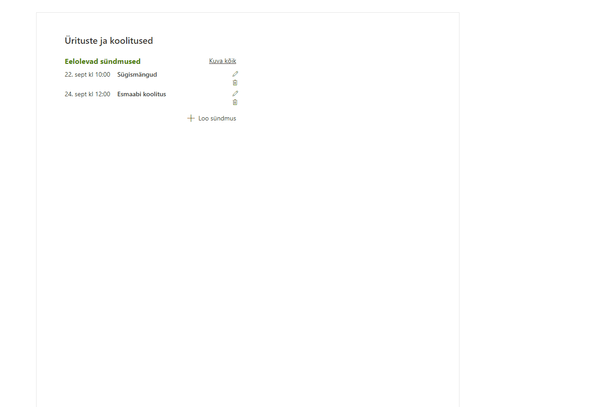
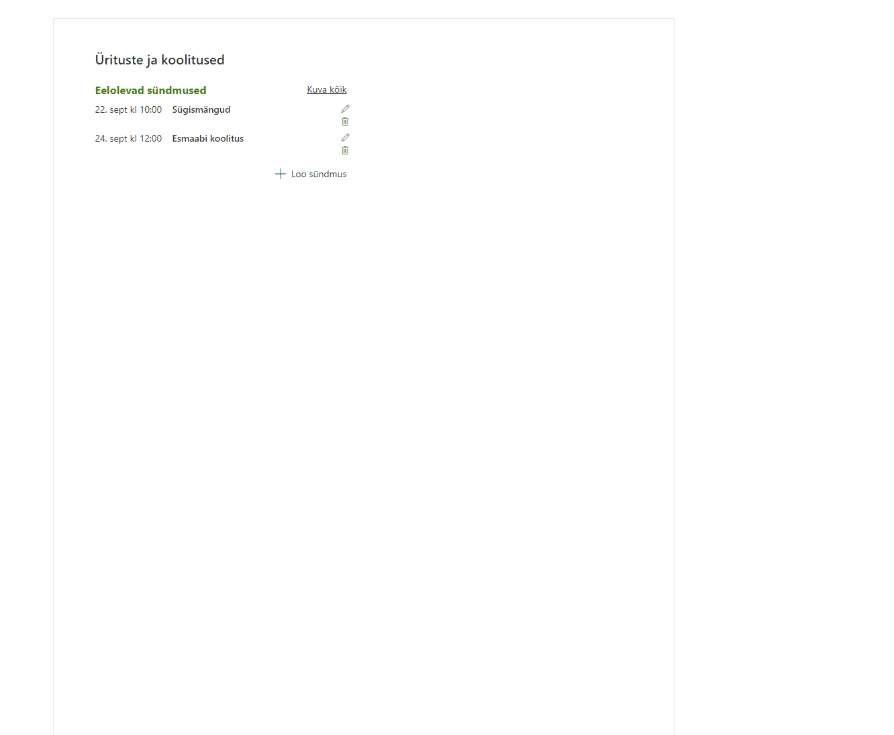

Veebiosa vóimaldab kasutajatel kuvada eelolevaid sündmuseid, hallata ja registreeruda sündmustele. Kogu haldamine on veebiosa sätetes detailselt seadistatav. Saab määrata eraldi sündmuste loojate ja administraatorite grupid. Toetatud on ka sündmustega seotud e-maili teavitused.

Veebiosas vaikimisi kuvatakse eelolevaid sündmuseid, mille periood on eraldi seadistatav. Eraldi saab valida ka kóik eelolevad sündmused.
Sündmuse pealkirjale klikkides avaneb detailinfo paneel, koos registreerimise nupuga. Kui sündmuse puhul on osalejate info avalikuks tehtud, näidatakse ka osalejate nimekirja.
{: style="width:1400px" }

Uue sündmuse loomisel saab lisaks detailinfole määrata ka sihgrupid, kellele sündmust näidatakse ja kellel on vóimalik sündmusele registreerida. Manuste lisamine on samuti vóimaldatud.
