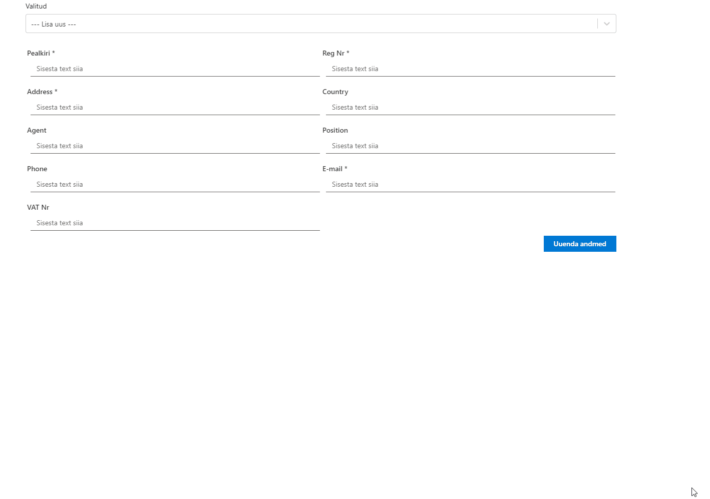
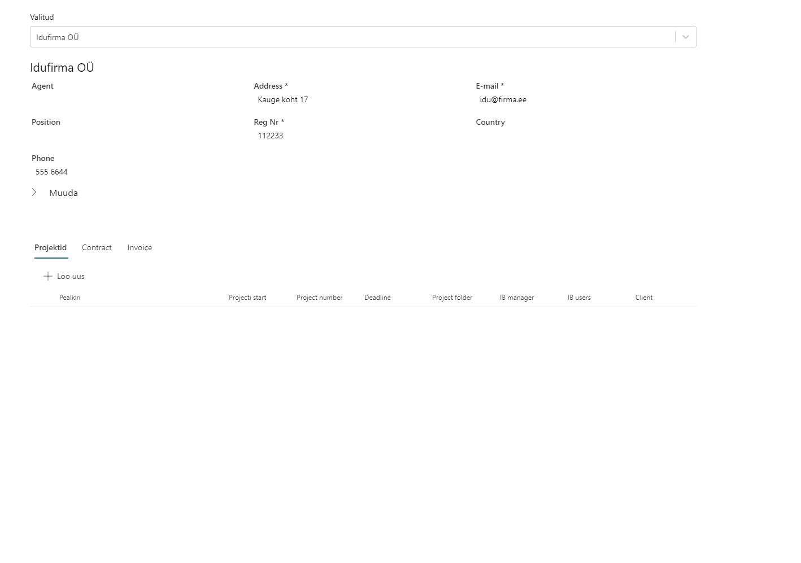
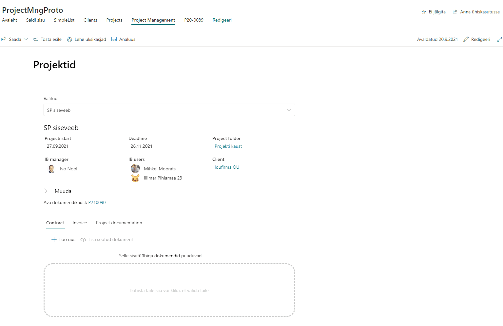

Projektihalduse veebiosa võimaldab keskselt hallata projekte. Esmalt luuakse klient/ettevõte, kellega soovitakse seostada uus projekt. Ühe ettevõttega võib seotud olla üks kuni mitu projekti.

Uue projekti loomisel, peale metainfo täitmist, luuakse projekti dokumentatsiooni jaoks eraldi teek. Link on nähtav ka projekti vormil.

Teeki saab dokumente otse vormilt üles laadida või genereerida eeldefineeritud dokumendimallidelt.

***
*Versioon: 1.2.6.3*