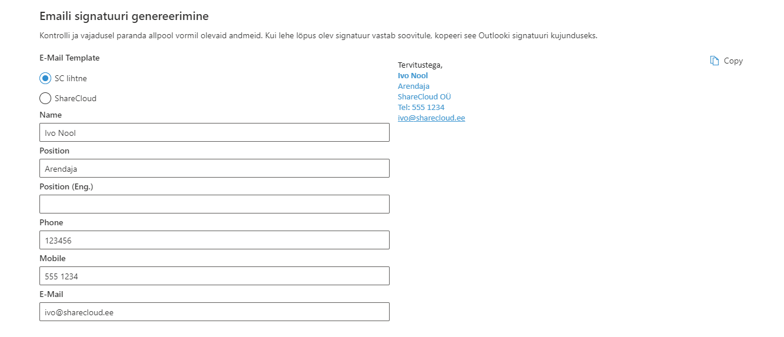


E-maili signatuuri genereerimise veebiosa võimaldab lihtsasti luua signatuuri e-maili jalusesse. Lehe laadimisel laetakse kasutaja andmed AD-st. Kõiki andmeid saab muuta ja täiendada.

Kasutajal on võimalik valida eeldefineeritud mallide seast. Malle hoitakse ja hallatakse eraldi Sharepointi loendis.
Veebiosa paremas osas kuvatakse signatuuri eelvaadet ja nuppu signatuuri kopeerimiseks lõikelauale. 

Lihtsalt klikka kopeeri (copy) nupule ja kleebi (paste) loodud allkiri oma Outlooki. 

***
*Versioon: 1.0.3.111*