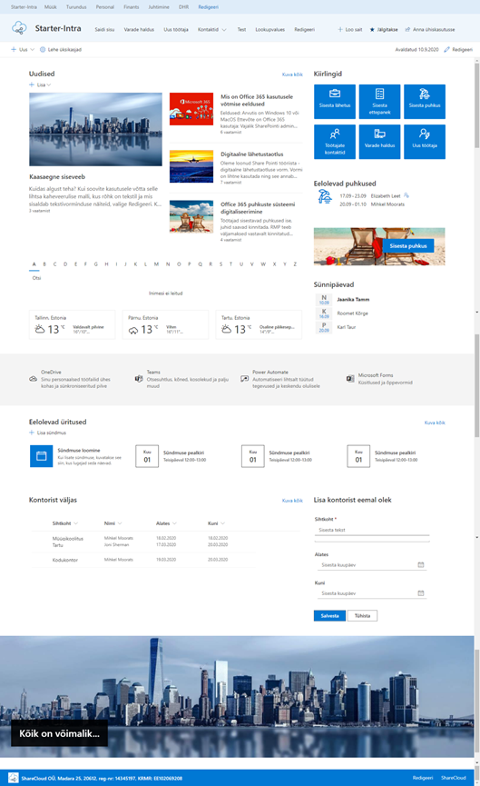
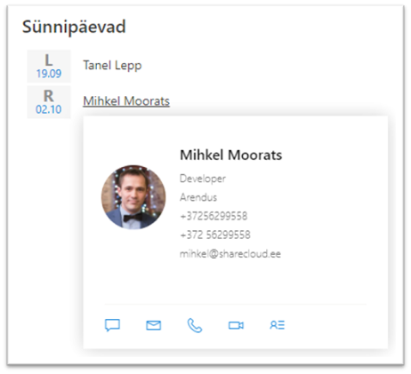

# Siseveebi baaspakett

Siseveebi baaspakett sisaldab enim kasutatavaid mooduleid.

## Eelseadistatud avaleht
* Sisaldab peamisi mooduleid ja veebiosasid

## Uudised
* Kujunda ise viisakad ja modernsed uudised. Uudiskirja võimalus, kommenteerimine, osakondade uudiste koondamine.

## Töötajate register
* Loend töötajate kontakt-infoga, manuaalselt hallatav
* Grupeeritud osakondade kaupa
* Saab sisestada ka O365 kontota töötajate infot

## Sünnipäevade kuvamine avalehel
* Kuvatakse eelolevaid sünnipäevi töötajate registrist
* Töötaja nimel hiirega liikudes avaneb töötaja kaart detailsema infoga

## Telefoniraamat
* Lihtne töötajate otsing tähestiku alusel
* Võimaldab teha otsingut ettevõtte AD kontodega töötajate hulgast
* Otsitulemusi saab filtreerida osakonna ja kontori lõikes

## Varade haldus
* Ettevõtte varade register – aitab silma peal hoida mis kelle käes kasutuses ning millal lõppeb autol kindlustus.
* Erinevad vara liigid: arvuti, auto, IT seadmed jne.

## Kaebused ja ettepanekud
* Hangi tagasisidet oma töötajate murede ja ettepanekute kohta.
* Ettepaneku esitamise vorm ja register

## Kontorist väljas teadetetahvel
* Võimaldab saada kiire ülevaade kontorist väljas olevatest kolleegidest ning lisada enda kontorist väljas olek.

## Puhkuste register
* Võimaldab sisse kanda ning näha kolleegide planeeritavaid puhkuseid
* Eelolevad puhkused kuvatakse avalehe puhkuste veebiosas

## Lähetuste register
* Võimaldab sisse kanda ning näha kolleegide planeeritavaid lähetusi

## Uue töötaja infokaart
* Personalitöötaja töövahend - võimaldab sisse kanda uue töötaja kontaktinfo ning hiljem selle peale luua automaatsed töökäsud süsteemide ligipääsude, kontoritarvete tellimise jne teostamiseks vastavalt valdkonna vastutajatele.