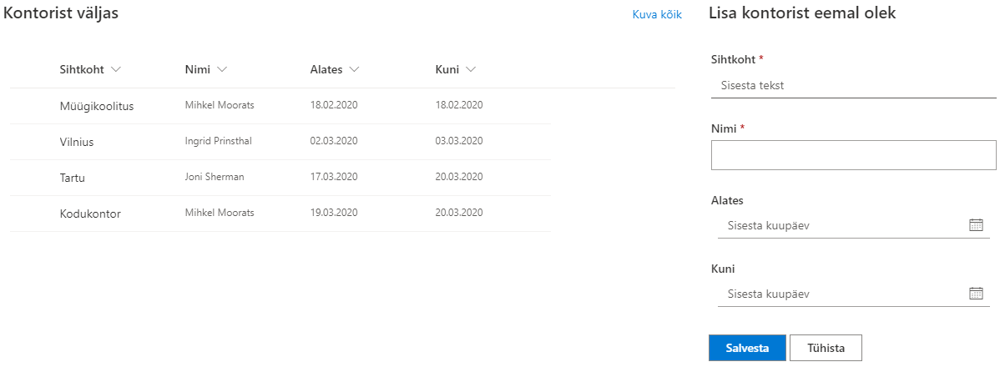

# Siseveebi baaspakett
*Versioon: 2.4.10.111*

Siseveebi baaspakett sobib igas suuruses ettevõttele ning pakub hea stardipositsiooni ettevõtte siseveebiga alustamiseks. See sisaldab enim kasutatavaid mooduleid, mida oleme näinud läbivalt ettevõtete siseveebides kõige olulisematena.

Siseveeb koondab tööks kogu vajaliku info ettevõtte töötajatele mugavasti ühte kohta - uudised, töötajate kontaktid, juhendid, avalduste vormid ja palju muud. Starter-Intra pakub selleks kõik esmavajaliku, et selle pealt edasi kohandada siseveeb mis on just Sinu ettevõtte nägu.

## Eelseadistatud avaleht
Siseveebi avaleht koondab kõik olulise ning sisaldab peamisi mooduleid ja veebiosasid:

* [Uudised](#uudised)
* Kiirlingid
* [Eelolevad puhkused](#puhkuste-register)
* [Sünnipäevad](#sunnipaevade-kuvamine)
* [Telefoniraamat](#telefoniraamat)
* Üritused
* [Kontorist väljas](#kontorist-valjas-teadetetahvel)
* ja palju muud...

## Uudised
Sharepointi vaikimisi uudiste komponent võimaldab:

* luua modernsed ja kaunilt kujundatud uudiseid
* lisada uudisena linki veebis olevale artiklile või uudisele
* koostada uudiskirja olemasolevatest uudistest ning edastada töötajatele
* kommenteerida ja uudist meeldivaks märkida
* koondada erinevate osakondade uudised avalehele kokku
* ja palju muud

## Töötajate kontaktid
Leia alati üles oma kolleegid ja nende kontaktinfo

* Loend töötajate kontakt-infoga, manuaalselt hallatav
* Grupeeritud osakondade kaupa
* Saab sisestada ka O365 kontota töötajate infot

## Sünnipäevade kuvamine
* Kuvatakse eelolevaid sünnipäevi töötajate registrist
* seadistatav, kui mitu päeva tulevikku sünnipäevi kuvatakse
* Töötaja nimel hiirega liikudes avaneb töötaja kaart detailsema infoga

## Telefoniraamat

* Lihtne töötajate otsing tähestiku alusel
* Võimaldab teha otsingut ettevõtte AD kontodega töötajate hulgast
* Otsitulemusi saab filtreerida osakonna ja kontori lõikes
* töötajal klikates avaneb töötaja kaart detailsema infoga

## Varade haldus
Korrasta ja organiseeri ettevõtte varad - selleks saab kasutada Varade registrit, kuhu saab sisse kanda kõik varad, määrata nende vastutavad kasutajad ning hoida silma peal, kui mõne varaga on vaja mõnd lepingut uuendada.

* Ettevõtte varade register – aitab silma peal hoida mis kelle käes kasutuses ning millal lõppeb autol kindlustus.
* Erinevad vara liigid: arvuti, auto, IT seadmed jne.
* saab määrata vastutavad töötajad ning näha igale töötajale usaldatud varasid

## Kaebused ja ettepanekud
Vormi veebiosa, mida saab kasutada mistahes info sisestamiseks Sharepointi listi. Näiteks kaebuste ja ettepanekute kogumiseks töötajatelt.

* Hangi tagasisidet oma töötajate murede ja ettepanekute kohta.
* Ettepaneku esitamise vorm ja register
* vorm kohandub vastavalt seadistatud SP listi väljadele

## Kontorist väljas teadetetahvel
Moodul võimaldab:

* saada kiire ülevaade kontorist väljas olevatest kolleegidest 
* lisada enda kontorist väljas olek.
* sageli kasutatakse ka 'täna kontoris', kui enamasti tehakse kaugtööd

## Puhkuste register
Võimaldab sisse kanda ning näha kolleegide planeeritavaid puhkuseid

* puhkuse sisestamse vorm
* puhkuste register
* eelolevad puhkused kuvatakse avalehe puhkuste veebiosas

## Lähetuste register
* Võimaldab sisse kanda ning näha kolleegide planeeritavaid lähetusi

## Töötaja kontaktikaart
* koondab kokku töötaja kontaktinfo koos profiilifotoga
* töötaja saab ise sisestada tutvustuse enda kohta (Delve teenuses 'About me')
* kuvab eelolevaid puhkuseid

## Pildigalerii
* võimaldab koondada vimased pildialbumid lehele kokku
* saab kasutada erinevaid kujundusi selle kuvamiseks
* albumil klõpsates suunatakse kasutaja vastavasse albumi kausta pilte vaatama

