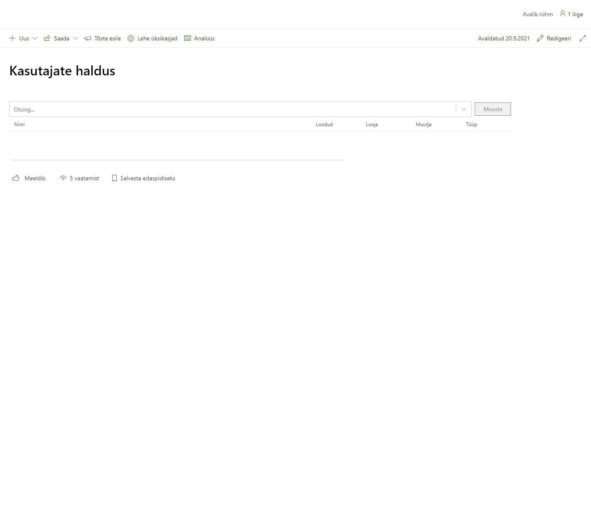

*Versioon: 1.0.9.111*

Lahendus võimaldab lihtsasti hallata kasutajaid Active Directory-s. Kasutajate halduses on kaks eraldi gruppi: muutjad ja kinnitajad. Kui muutjate gruppi kuuluv isik lisab uue kasutaja või redigeerib olemasolevat, salvestatakse eraldi loendisse muutmistaotlus.

AD kasutajaid saab mugavalt otsida. Kuvatakse nii aktiivseid kui mitteaktiivseid kontosid. Muudatustaotluste detailinfos on kirjas vanad ja uued väärtused.

Kinnitajate gruppi(üldjuhul IT töötajad, kes omavad õiguseid AD muudatuste tegemiseks) kuuluvad isikud saavad kinnitada teiste kasutajate poolt loodud muutmistaotlusi. Kui kinnitajate gruppi kuuluv isik lisab uue või redigeerib kasutajat, siis see eraldi kinnitamist ei vaja, muudatused tehakse koheselt.

