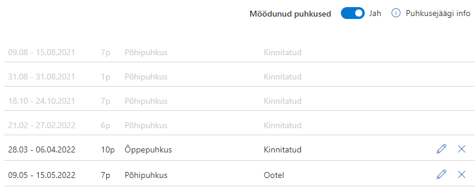
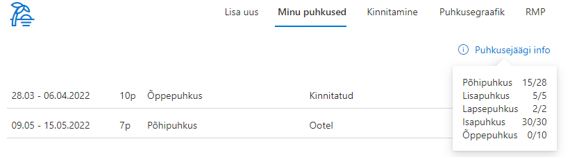
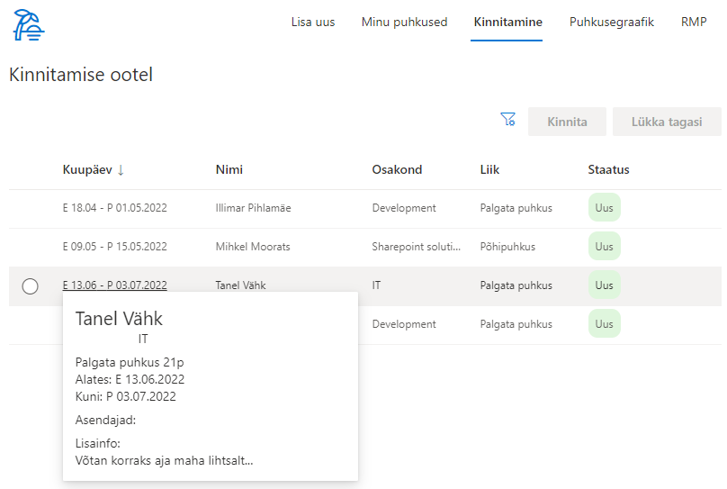
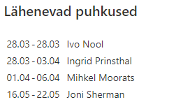

# Puhkuste haldus

Puhkuste halduse lahendus võimaldab ettevõtetel hallata oma töötajate puhkuseid mugavalt ühes kohas. Kogu puhkuste protsess on automatiseeritud alates avalduse esitamisest kuni puhkuste ajakava koostamiseni.
## Puhkuse avalduse sisestamine
Süsteem tuvastab automaatselt sisselogitud kasutaja nime ja tema otsese juhi.
Töötaja saab vormil soovi korral määrata endale asendaja või mitu, valida töötasu saamise eelistuse ning soovi korral lisada täpsustava kommentaari lisatavate puhkuste kohta.

 Süsteem pakub kasutajale vaid neid puhkuseliike, mida tal on õigus kasutada. Sõltuvalt valitud puhkuseliigist arvutab süsteem tema kasutada olevate puhkusepäevade jäägi. 
 
 Samal vormil saab sisestada mitme puhkuse avaldused korraga. Süsteem arvestab ning teavitab riigipühadest valitud puhkuseperioodil ning hoiatab, kui sisestatav puhkus kattub mõne asendaja puhkusega. 
 
 Puhkuseavaldusega on võimalik kaasa lisada manusena dokumenti. Näiteks tõend õppepuhkuse või lapsepuhkuse saamiseks.
 

## Minu puhkused

Minu puhkuste vahelehel kuvatakse kõiki aktiivseid puhkuseid. Lisaks kuvatakse puhkused, mille puhul mina olen määratud asendajaks.

'Minu puhkused' vaates saab esitatud puhkuseavaldusi tühistada ja/või muuta. Juba kinnitatud puhkuseavalduse muutmisel peab see läbima uuesti kinnitamise otsese juhi poolt.

Juba möödunud puhkuste kuvamiseks saab klikata 'Möödunud puhkused' ning süsteem näitab hallina ka varasemaid puhkuseid

Samuti saab töötaja näha enda puhkusejääke puhkuseliikide lõikes, kus esimene number näitab kasutada olevat jääki ning teine number kogu jääki käesoleval aastal:

## Puhkuste kinnitamine

Puhkuste kinnitamise vahelehte näevad vaid kinnitajate gruppi kuuluvad kasutajad. Kasutajale näidatakse vaid tema alluvatele kuuluvaid puhkuseid. Puhkuseid on võimalik valida ühe või mitme kaupa ja kinnitada kõik või tagasi lükata. Tagasi lükkamisel on võimalus sisestada kommentaar otsuse kohta.

Iga puhkuse peal hiirega hoverdades kuvatakse selle puhkuseavalduse kohta täpsem info. Sealhulgas ka avaldusel täidetud Lisainfo, kui see on täidetud:

## Puhkusegraafik

Puhkuse graafiku vaates on võimalik näha kõiki puhkuseid üheskoos. Vaheleht on nähtav kõigile kasutajatele. Vaadet on võimalik filtreerida aastate ja osakondade kaupa. Eraldi on võimalik kuvada ka ainult kinnitatud puhkused. Puhkused grupeeritakse töötajate ja puhkuse liigi järgi.

## Raamatupidamise vaade

Raamatupidamise vaheleht on nähtav vaid raamatupidamise gruppi kuuluvatele kasutajatele. Selles vaates saavad raamatupidajad puhkuseid muuta, kinnitada või tagasi lükata. Lisaks saab puhkuseid filtreerida puhkuse alguse, lõpu või kinnitamise staatuse järgi.

## Puhkuste aastavaade
Kõik puhkused kuvatakse koondina aastavaates ja on värvidega eristatud vastavalt avalduse kinnitamise staatusele. Aastavaates saab mugavalt navigeerida aasta, kvartali ja kuude lõikes ja filtreerida isiku ja osakonna alusel.

## Eelolevad puhkused
Siseveebi avalehel lähenevate puhkuste kuvamiseks on lahenduses eraldi kompaktne veebiosa, mis kuvab lähenevaid puhkuseid. Antud veebiosa puhul saab seadistada kui mitu nädalat tulevikus algavaid puhkuseid kuvatakse

***
Uuendame ja arendame puhkustehalduse lahendust pidevalt edasi ning kõiki lahenduses olemasolevaid võimalusi ei pruugi siin kirjelduses veel üleval olla.
Kui Sul on mõte või idee, mis peaks kindlasti veel ühes head puhkustehalduses olema - anna meile julgelt märku: <mihkel@sharecloud.ee>

*Versioon: 1.4.7.112*