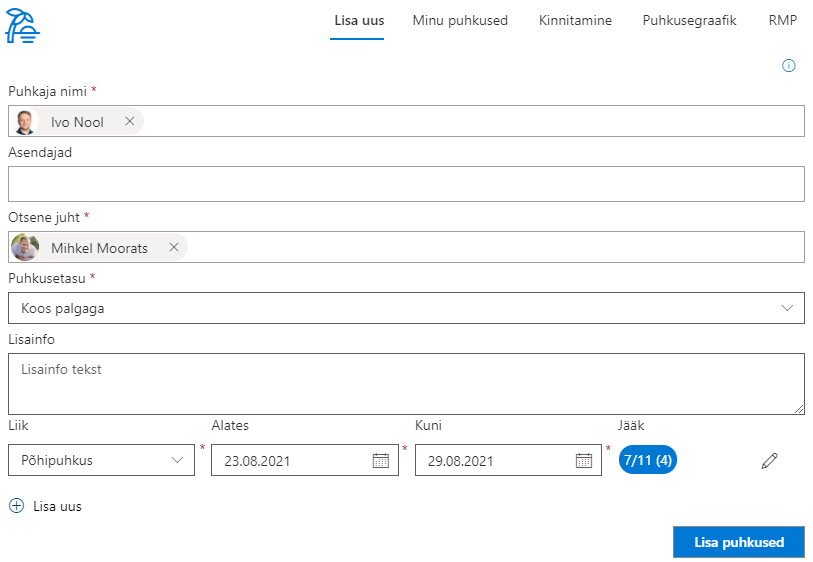

# Puhkuste haldus

Puhkuste halduse lahendus võimaldab ettevõtetel hallata oma töötajate puhkuseid mugavalt ühes kohas.

## Uue puhkuse lisamine

Süsteem tuvastab kasutajaprofiili andmetest automaatselt kasuta nime ja tema otsese juhi. 
Kasutajale pakutakse vaid neid puhkuseliike, mida tal on õigus kasutada. Sõltuvalt valitud puhkuseliigist arvutab süsteem puhkuse päevade jäägi. Kasutajat hoiatatakse juhul kui sisestatav puhkus kattub riigipüha, teiste puhkuste või asendaja puhkustega. Puhkuse sisse jäävad riigipühad arvestatakse automaatselt puhkusest maha. Peale avalduse sisestamist saadetakse see otsesele juhile kinnitamiseks.

## Minu puhkused

Minu puhkuste vahelehel kuvatakse kóiki aktiivseid puhkuseid. Lisaks kuvatakse puhkused, mille puhul kasutaja on määratud asendajaks.

## Puhkuste kinnitamine

Puhkuste kinnitamise vahelehte näevad vaid kinnitajate gruppi kuuluvad kasutajad. Kasutajale näidatakse vaid tema alluvatele kuuluvaid puhkuseid. Puhkuseid on võimalik valida ühe või mitme kaupa ja kinnitada kõik või tagasi lükata. Tagasi lükkamisel on võimalus sisetada kommentaar otsuse kohta.

## Puhkusegraafik

Puhkuse graafiku vaates on võimalik näha kõiki puhkuseid üheskoos. Vaheleht on nähtav kõigile kasutajatele. Vaadet on võimalik filtreerida aastate ja osakondade kaupa. Eraldi on võimalik kuvada ka ainult kinnitatud puhkused. Puhkused grupeeritakse töötajate ja puhkuse liigi järgi.

## Raamatupidamise vaade

Raamatupidamise vaheleht on nähtav vaid raamatupidamise gruppi kuuluvatele kasutajatele. Selles vaates saavad raamatupidajad puhkuseid muuta, kinnitada või tagasi lükata. Lisaks saab puhkuseid filtreerida puhkuse alguse, lõpu või kinnitamise staatuse järgi.

## Puhkuste aastavaade
Kõik puhkused kuvatakse koondina aastavaates ja on värvidega eristatud vastavalt avalduse kinnitamise staatusele. Aastavaates saab mugavalt navigeerida aasta, kvartali ja kuude lõikes ja filtreerida isiku ja osakonna alusel.

