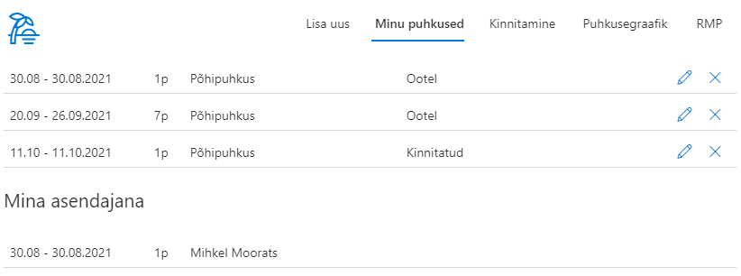

# Puhkuste haldus
*Versioon: 1.4.7.112*

Puhkuste halduse lahendus võimaldab ettevõtetel hallata oma töötajate puhkuseid mugavalt ühes kohas.

## Puhkuse avalduse sisestamine
Süsteem tuvastab automaatselt sisselogitud kasutaja nime ja tema otsese juhi.
Töötaja saab vormil soovi korral määrata endale asendaja või mitu, valida töötasu saamise eelstuse ning soovi korral lisada täpsustava kommentaari lisatavate puhkuste kohta.

 Süsteem pakub kasutajale vaid neid puhkuseliike, mida tal on õigus kasutada. Sõltuvalt valitud puhkuseliigist arvutab süsteem tema kasutada olevate puhkusepäevade jäägi. 
 
 Samal vormil saab sisestada mitme puhkuse avaldused korraga. Süsteem arvestab ning teavitav riigipühadest valitud puhkuseperioodil ning hoiatab, kui sisestatav puhkus kattub mõne asendaja puhkusega. 
 
 Puhkuseavaldusega on võimalik kaasa lisada manusena dokumenti.
 

## Minu puhkused

Minu puhkuste vahelehel kuvatakse kõiki aktiivseid puhkuseid. Lisaks kuvatakse puhkused, mille puhul kasutaja on määratud asendajaks.

## Puhkuste kinnitamine

Puhkuste kinnitamise vahelehte näevad vaid kinnitajate gruppi kuuluvad kasutajad. Kasutajale näidatakse vaid tema alluvatele kuuluvaid puhkuseid. Puhkuseid on võimalik valida ühe või mitme kaupa ja kinnitada kõik või tagasi lükata. Tagasi lükkamisel on võimalus sisetada kommentaar otsuse kohta.

## Puhkusegraafik

Puhkuse graafiku vaates on võimalik näha kõiki puhkuseid üheskoos. Vaheleht on nähtav kõigile kasutajatele. Vaadet on võimalik filtreerida aastate ja osakondade kaupa. Eraldi on võimalik kuvada ka ainult kinnitatud puhkused. Puhkused grupeeritakse töötajate ja puhkuse liigi järgi.

## Raamatupidamise vaade

Raamatupidamise vaheleht on nähtav vaid raamatupidamise gruppi kuuluvatele kasutajatele. Selles vaates saavad raamatupidajad puhkuseid muuta, kinnitada või tagasi lükata. Lisaks saab puhkuseid filtreerida puhkuse alguse, lõpu või kinnitamise staatuse järgi.

## Puhkuste aastavaade
Kõik puhkused kuvatakse koondina aastavaates ja on värvidega eristatud vastavalt avalduse kinnitamise staatusele. Aastavaates saab mugavalt navigeerida aasta, kvartali ja kuude lõikes ja filtreerida isiku ja osakonna alusel.

