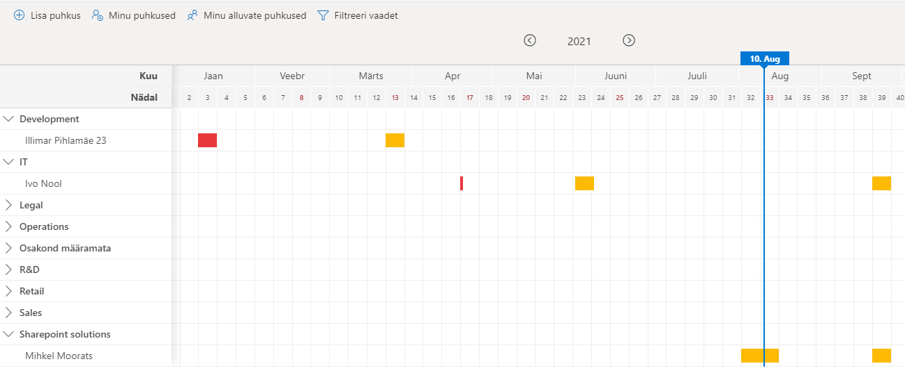

# Puhkuste haldus

Puhkuste halduse lahendus võimaldab kasutajatel täita puhkuseavaldusena digitaalse vormi 

## Puhkuse avalduse sisestamine
Süsteem tuvastab automaatselt sisselogitud kasutaja nime ja tema ülemuse.
Töötaja saab vormil soovi korral määrata endale asendaja või mitu, valida töötasu saamise eelstuse ning soovi korral lisada täpsustava kommentaari lisatavate puhkuste kohta.

 Süsteem pakub kasutajale vaid neid puhkuseliike, mida tal on õigus kasutada. Sõltuvalt valitud puhkuseliigist arvutab süsteem tema kasutada olevate puhkusepäevade jäägi. 
 
 Samal vormil saab sisestada mitme puhkuse avaldused korraga. Süsteem arvestab ning teavitav riigipühadest valitud puhkuseperioodil ning hoiatab, kui sisestatav puhkus kattub mõne asendaja puhkusega. 
 
 Puhkuseavaldusega on võimalik kaasa lisada manusena dokumenti.
 

## Puhkuste kinnitamine
Puhkusevaldus saadetakse seejärel kinnitamiseks otsesele juhile. Juhil on võimalik puhkuseavaldusi kinnitada ühekaupa või mitme töötaja avaldused korraga (Lisa 2. Puhkuste kinnitamine). 

## Puhkuste aastavaade
Kõik puhkused kuvatakse koondina aastavaates (Lisa 3. Puhkuste aastavaade) ja on värvidega eristatud vastavalt avalduse kinnitamise staatusele. Aastavaates saab mugavalt navigeerida aasta, kvartali ja kuude lõikes ja filtreerida isiku ja osakonna alusel.

## Puhkuste graafiku vaade
Eraldi puhkuste graafiku vaade võimaldab kuvada puhkuseplaani (Lisa 4. Puhkusegraafiku vaade). Seal on võimalik puhkuseid filtreerida aastate ja osakondade alusel ning välja printida või PDF-iks printida ning edastada allkirjastamiseks.

## Raamatupidamise ja personali vaade
Lisaks on raamatupidajatele ja personalitöötajatele mõeldes loodud eraldi vaade eelolevatest puhkustest näha vaid neile (Lisa 5. Raamatupidamise ja personali vaade). Vaates on võimalik määrata ajavahemikku, mis perioodi puhkuseid kuvatakse, filtreerida kinnitamise staatuse alusel ning kinnitada või tagasi lükata puhkuseavaldusi. Samuti on võimalik puhkustes teha muudatusi kui on vaja.
